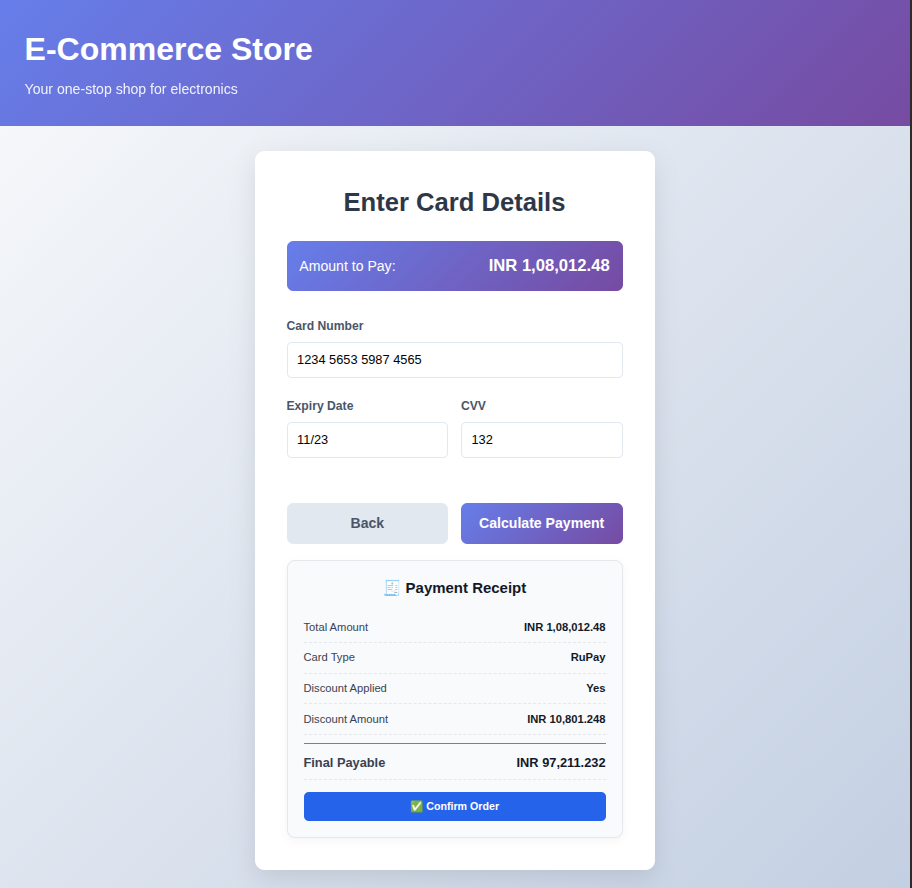

# Payment Assessment – Notes

This file documents the design decisions, assumptions, and trade-offs made while implementing the Ecommerce Payment flow for the Avalpha Technologies technical assessment.

---

## Key Design Decisions

- All business logic for discount calculation is implemented in the backend (`Payments.Domain`) to keep rules centralized and consistent.
- The frontend is responsible only for collecting user input, calling the API, and displaying results.
- A structured DTO is returned from the backend containing:
  - Total amount
  - Discount applied
  - Discount amount
  - Final payable amount
  - Card type
- Clear separation of concerns is maintained between:
  - Domain layer (discount logic)
  - API layer (controllers and DTOs)
  - UI layer (React components)

---

## Trade-offs Made

- Real payment gateway integration was intentionally not implemented, as the focus was on logic and data flow.
- No database or persistence was added to keep the solution simple and aligned with the assignment scope.
- UI styling was kept minimal and functional rather than pixel-perfect.

---

## Assumptions

- Card type is determined based on the prefix rule provided in the problem statement.
- If the card number does not match known prefixes, the default card type is RuPay.
- Basic client-side validation (length and format checks) is sufficient for this assessment.
- Currency formatting is handled on the frontend for user readability.

---

## What Was Not Implemented

- Authentication and authorization.
- Order storage or transaction history.
- Production deployment configuration.
- Advanced UI animations.

---

## How to Run the Application

### Backend
```bash
cd backend/Payments
dotnet run

Runs at:
hppt://localhost:508

```
### Frontend

```bash
cd frontend
npm install
npm run dev

Runs at:
hppt://localhost:5173
```
### Swagger:

``` bash
http://localhost:5084/swagger
```

### UI Preview



