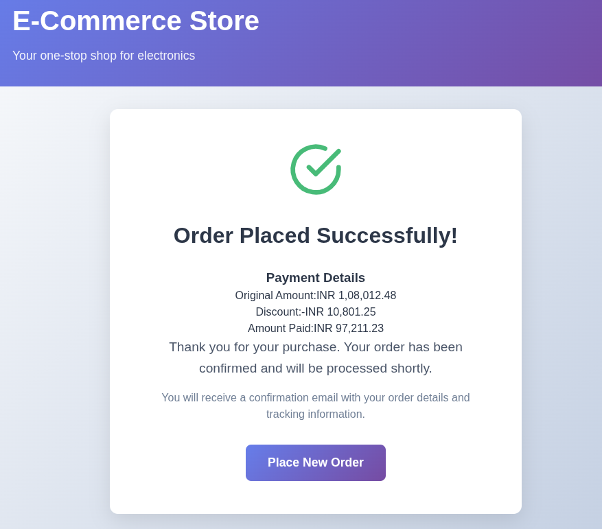

# README Notes

This document describes the design decisions, assumptions, and trade-offs made while completing the payment assessment.

---

## Design Decisions

- **Business Logic Separation**: Business logic such as card type detection and discount calculation is implemented entirely in the backend domain layer (`Payments.Domain`) to keep controllers thin and maintain separation of concerns.

- **Frontend as Thin Client**: The frontend is treated as a thin client that only collects user input and displays results returned by the backend.

- **Immediate Feedback**: Discount information and final payable amount are displayed in the payment form itself to provide immediate feedback to the user after payment processing.

- **Simple Success Screen**: The order success screen displays payment details including discount breakdown, providing transparency about the final amount paid.

---

## Frontend–Backend Integration

- The frontend communicates with the backend using the REST endpoint:

```
POST /Payments/Pay
```

- Request payload structure:

```json
{
  "amount": number,
  "cardDetails": {
    "cardNumber": string,
    "expiry": string,
    "cvv": string
  }
}
```

- Backend response:

```json
{
  "discountApplied": boolean,
  "amount": number
}
```

- The backend response is treated as the single source of truth for discount application and final amount calculation.

- **CORS Configuration**: Added CORS policy in backend to allow requests from frontend running on `localhost:5173` (Vite default port).

---

## Trade-offs Made

- **Card Validation**: Advanced card validation (e.g., Luhn algorithm) was skipped to keep the scope focused on assessment requirements. Basic validation (16 digits, expiry format, CVV length) is implemented.

- **Card Type Display**: Card type is not displayed in the UI since it is an internal implementation detail and not required for the user-facing flow.

- **HTTPS Configuration**: HTTPS redirection is enabled but HTTP is also allowed for local development simplicity.

- **UI Styling**: CSS styling was kept minimal and focused on clarity and functionality rather than extensive customization.

- **Error Messages**: Generic error messages are shown instead of detailed API error responses to keep UX simple.

---

## Error Handling

- **Backend Validation Errors**: Missing or invalid fields are handled by the backend and return appropriate HTTP status codes.

- **Network Errors**: Network or API connection errors are caught and displayed with user-friendly messages without crashing the UI.

- **Defensive Rendering**: Null checks and type validation were added to prevent runtime errors caused by undefined values in `OrderSuccess` component.

- **Property Access Safety**: Added fallback values when accessing payment data properties to handle incomplete API responses gracefully.

---

## Assumptions

- **Card Type Detection**: Card type detection is based on the first digit of the card number:
  * Starts with `4` → Visa
  * Starts with `5` → MasterCard
  * Starts with `6` → RuPay
  * Default → RuPay

- **Discount Rules**:
  * Visa → 0% discount
  * MasterCard → 5% discount
  * RuPay → 10% discount

- **Basket Data**: Basket items, prices, and GST calculation (18%) are static/hardcoded for this assessment.

- **Backend Port**: Backend runs on `http://localhost:5084` by default.

- **Frontend Port**: Frontend runs on `http://localhost:5173` (Vite default).

---

## Implementation Details

### Backend
- Card type detection logic implemented in `Payments.Domain.CalculateDiscount.GetCardType()`
- Discount calculation logic in `Payments.Domain.CalculateDiscount.Calculate()`
- RESTful API endpoint in `PaymentsController.Pay()`
- CORS middleware configured to allow frontend origin
- JSON serialization configured to handle camelCase from frontend

### Frontend
- Payment form with card input validation in `CreditCardForm` component
- API integration using native `fetch` API
- Payment state management in `Payment` component
- Discount display in both `CreditCardForm` (after payment) and `OrderSuccess` component
- Error handling with user-friendly messages

---

## Unfinished / Intentionally Skipped

- **Unit Tests**: Unit tests were not added due to time constraints. Tests would be valuable for:
  - Card type detection logic
  - Discount calculation logic
  - API endpoint contracts
  - Frontend component behavior

- **Integration Tests**: End-to-end tests were not implemented.

- **Card Type Display**: Card type and discount percentage are not displayed explicitly in the UI (they are internal implementation details).

- **Production Features**: Production-level security features were not implemented:
  - Authentication/Authorization
  - Rate limiting
  - Input sanitization beyond basic validation
  - Logging and monitoring
  - Database persistence

- **Advanced UI Features**: 
  - Loading states are minimal
  - No retry mechanisms for failed API calls
  - No offline handling

---

## Application Screenshots

### Payment & Discount Result



---

## How to Run Locally

### Prerequisites
- .NET 9.0 SDK
- Node.js (v18 or higher)
- npm or yarn

### Backend

```bash
cd backend/Payments
dotnet restore
dotnet run
```

The backend will start on `http://localhost:5084`. Swagger UI will be available at `http://localhost:5084/swagger` in development mode.

### Frontend

```bash
cd frontend
npm install
npm run dev
```

The frontend will start on `http://localhost:5173` (or the next available port).

### Testing the Flow

1. Open `http://localhost:5173` in your browser
2. You'll see the shopping basket with items and total
3. Click "Proceed to Pay"
4. Enter card details:
   - **Visa**: Card starting with 4 (e.g., 4123456789012345)
   - **MasterCard**: Card starting with 5 (e.g., 5123456789012345)
   - **RuPay**: Card starting with 6 (e.g., 6123456789012345)
5. Click "Pay Now"
6. Observe the discount being applied and final amount
7. View the order success screen with payment breakdown

---

## API Testing

You can test the API directly using curl:

```bash
curl -X POST http://localhost:5084/Payments/Pay \
  -H "Content-Type: application/json" \
  -d '{
    "amount": 91536.48,
    "cardDetails": {
      "cardNumber": "6123456789012345",
      "expiry": "12/25",
      "cvv": "123"
    }
  }'
```

Expected response for RuPay card (10% discount):
```json
{
  "discountApplied": true,
  "amount": 82382.83
}
```

---

## Final Notes

The solution focuses on **correctness, clean architecture, and stability**. Key achievements:

- ✅ Clean separation between frontend and backend
- ✅ Business logic isolated in domain layer
- ✅ Proper error handling and user feedback
- ✅ Discount calculation works correctly for all card types
- ✅ Defensive programming to prevent runtime errors

The codebase can be easily extended to support:
- Additional card types and discount rules
- Configurable discount percentages
- Enhanced UI features and styling
- Comprehensive test coverage
- Production-ready security features

---

## Known Issues / Future Improvements

- **API Error Details**: Currently shows generic error messages. Could be enhanced to show specific validation errors from backend.

- **Loading States**: Could add more detailed loading indicators during API calls.

- **Form Persistence**: Card details are lost if user navigates away. Could be stored in localStorage temporarily.

- **Responsive Design**: UI could be enhanced for mobile devices.

- **Accessibility**: Could add ARIA labels and keyboard navigation improvements.

